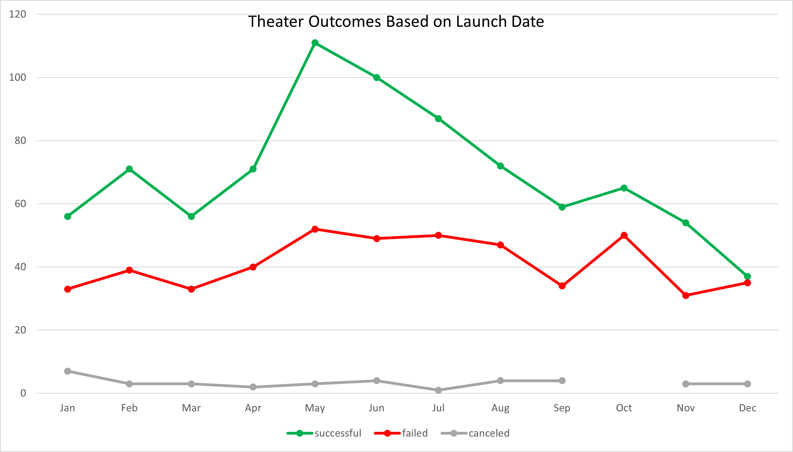
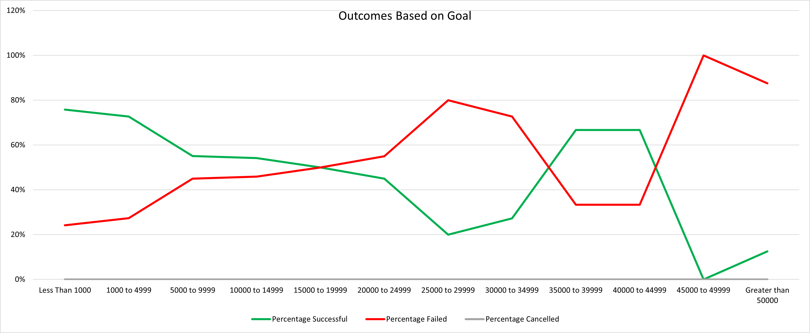

# An Analysis of Kickstarter Campaigns

## Overview of Project
The purpose of the project is to analyze and interpret Kickstarter campaigns based on launch date and funding goals. We are looking for data which will help determine the best time of year to launch a campaign and the ideal dollar range for setting fundraising goals. Insights gathered from the analysis will help determine the viability of Kickstarter campaigns for theater projects, and what decisions need to be made to set up a campaign with the highest probability of success. 

### Purpose
The data will be used to help understand the success or failure of Louise's Fever campaign relative to similar theater campaigns and refine strategies for future Kickstarter campaigns. 

## Analysis and Challenges
The analysis was performed on Kickstarter campaigns from 2009 to 2017. Campaigns were defined by category and subcategory. For our purposes, we used all data from the parent category, Theater, which includes the subcategories of Plays, Musicals, and Spaces. Data from the Theater category was aggregated for review based on the timing of the campaign launch and fundraising goal. Launch date is defined as the month and year of the campaign launch. 

### Analysis of Outcomes Based on Launch Date
For the analysis of outcomes based on launch date we reviewed data on a monthly basis. Data from the full time period was aggregated to determine trends in the success or failure of campaigns based on the month launched. In total, 1,369 Theater campaigns were reviewed. We analyzed the data by creating a pivot table of the annual data summarized by the month each campaign was launched. The data can be distilled further by looking at years individually. The aggregate data for all Theater campaigns is summarized visually below by showing the trend of successful, failed, and canceled campaigns over the course of the year. 

### Analysis of Outcomes Based on Goals
For the goal based outcomes analysis the Theater data was filtered to only contain information on Plays. Filtering the data for Plays specifically provides a more accurate dataset versus including the other Theater subcategories, Musicals and Spaces. After filtering the data, fundraising goals were segmented into ranges with the lowest range of less than $1,000 then increasing in $5,000 intervals to $50,000 or greater. Campaigns were then counted based on success, failure, or cancellation. The total number of projects within each range was used to calculate the percentage of successful, failed, or cancelled campaigns. We then created a pivot table analysis of the percentage-based outcome data which is summarized below. 

### Challenges and Difficulties Encountered
Challenges in the analysis included converting epoch time codes to MM/DD/YYYY dates. A formula was used to convert each date. We are confident the formula correctly converted each date, but the calculation may increase the likelihood of an error. Additionally, the subcategories of Theater may not all apply to the analysis task. Specifically, campaigns for Spaces are the most dissimilar to the campaign we are analyzing. This challenge could be overcome by adding a subcategory filter to the Outcome Based on Launch Date table. 

Challenges encountered in the Outcomes Based on Goals analysis included creating a formula to calculate the number of campaigns within a specific range. The challenge was handled by using the COUNTIFS() formula which allowed for specific parameters to be used for summing the Kickstarter data. Another potential challenge could be determining the ranges to use for each count. The absolute spread of campaign goals is wide, but the distribution of campaigns is heavily weighted toward lower dollar value campaigns. 

#### Limitations of the Dataset
The dataset for outcomes based on goals is right skewed which means we have much more data for smaller campaigns than for larger campaigns. The smaller number of high goal campaigns may make the percentage successful misleading. For example, campaigns off $20,000 or greater make up only 6% of our dataset but are represented by more than 50% of the campaign goal ranges we reviewed. The success of these campaigns was mixed, but the positive results from the $20,000 or greater goal subset could make it appear that the fundraising goal should be higher. 

Higher number of campaigns in the months with the most success so there may just be more successful campaigns because there are more campaigns overall. More campaigns may also mean more competition during the popular months. 

## Results

### Findings of Outcomes Based on Launch Date
Based on our analyses we can determine the following regarding campaign outcomes based on launch date.
- Campaigns launched during summer months have the most success. Specifically, April through August is the ideal time to launch a Theater campaign. Summer months were also the most popular time to launch a campaign. We may assume summer months are more popular with theater goers who are looking for activities. Additionally, summer programs for students/children may also increase the number of campaigns launched and potentially the overall success of a campaign. These campaigns may have more of a network effect with money raised from family and friends of people participating in the program. Overall, summer months are recommended for launching a campaign, but the amount of competition may lead to more costs for campaign marketing and promotion to avoid getting caught in the summer launch crowd. 

- Campaigns launched at the end of the year have the least amount of success. Specifically, campaigns launched from September through December are less likely to be successful. Additionally, a lower number of campaigns are launched during these months. The lower success rate may be a seasonal factor. People may be less likely to spend money on entertainment during holiday spending months. Also, theater performances may be influenced by competition from things like school plays, holiday events, etc. So, while there would be less competition for fundraising during this time the probability of success is much lower.  

### Findings of Outcomes Based on Goals
Based on our analyses we can determine the following regarding campaign outcomes based on goals.
- Campaigns with lower goals are more likely to meet their goals. We see a significant drop off in success for campaigns seeking $25,000 or more. We can determine it is easier to raise less money. If the goal of the project is to reach 100% funding it may make sense to ask for an amount lower than $10,000. 
- The probability of success for most campaigns is around 50/50. Campaigns between $5,000 and $25,000 have near 50/50 odds of success. As the goal is increased the number of campaigns decreases, therefore the percentage data may be somewhat misleading. Additionally, the data shows us that setting a higher goal may be beneficial to the success of the project because the odds of success are the same for a wide range of goals. If the fundraising target is based on budget needs it's possible that setting a higher goal may benefit the scope of our specific project by leading to higher than expected donations despite not meeting the campaign goal. This strategy may not work well for goals set above $20,000. This could be due to a lack of confidence in the campaign following through on their promises if goals are set high. People may be less likely to donate to a $1,000,000 campaign and feel like they lost their money if the campaign gets cancelled as opposed to donating to a $10,000 campaign which is likely to succeed. 

### Dataset Limitations
The dataset filtered by date of launch may be more influenced by the number of campaigns launched in popular months. It's possible that there is more success in summer months because there are more campaigns in summer months, not because there is more success in general. The data could possibly be normalized to compare each month more accurately. 

The dataset for outcomes based on goals is right skewed which means we have much more data for smaller campaigns than for larger campaigns. The smaller number of high goal campaigns may make the percentage successful misleading. For example, campaigns off $20,000 or greater make up only 6% of our dataset but are represented by more than 50% of the campaign goal ranges we reviewed. The success of these campaigns was mixed, but the positive results from the $20,000 or greater goal subset could make it appear that the fundraising goal should be higher. 

The categories and subcategories may not be the best representation of the project we are analyzing. For example, Theater includes Spaces which are focused on performance venues instead of performances themselves. Additionally, Plays includes campaigns for launching festivals or campaigns unrelated to creating the play itself such as requests for travel funds or creating acting programs. 

### Potential Ideas for Further Analysis
What are some other possible tables and/or graphs that we could create?
- Look at money raised above or below goal. If you set a lower goal are you more likely to exceed it by a wide margin and how wide? If you set a higher goal than your budget needs are you more likely to reach your goal or exceed your budget?
- Analyze average donation size and number of donations for goal ranges. This could help with understanding how to market your campaign. If you can figure out a range of donations per person you can set a target for campaign outreach. 
- Analyze staff pick and spotlight data. Do internal promotions from Kickstarter lead to better outcomes? If so, what is the cost of a spotlight feature or how is a campaign chosen as a Staff Pick? The cost for each may be worth it if it helps campaigns meet their goals. 
- What is the average length of a campaign? It may be great to know the best month to launch but if there is a specific time-line in place launching during the most successful months may not be possible. Further analysis on this topic could include reviewing length of campaign versus campaign goal.
